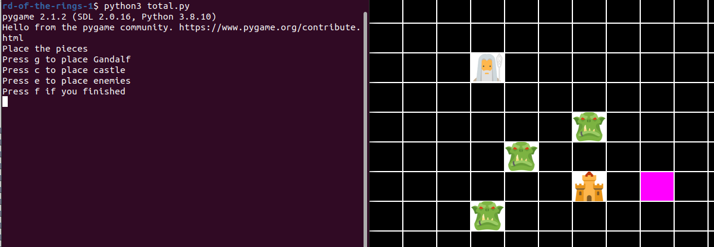
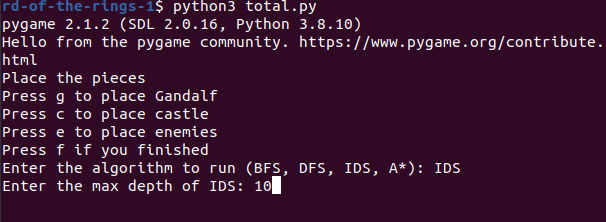
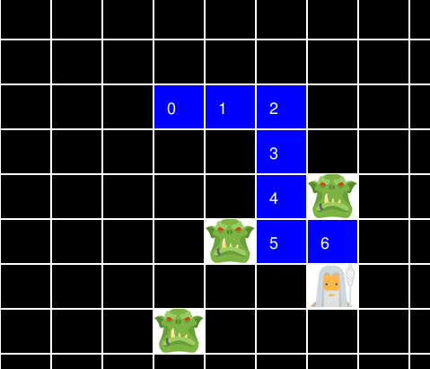

# Lord of the Rings
Comparison of different search algorithms in artificial intelligence.

This project is an extension of the [second assignment of the Artificial Intelligence Course](https://github.com/amirmahdiansaripour/Artificial-Inteligence-Assigments) I have taken in the University of Tehran, Spring 2022. The project is about different searching mehtods (BFS, DFS, IDS, and Astar), and demonstrates how they differ in the way their frontier and explored sets are updated.

## How to run :

Make sure that the pygame library is installed on your OS for graphical interface.

`
python3 total.py
`

A window will be shown, in which the pieces of the game should be placed (Gandalf, Orcs, and The Castle). You can switch between cells in the grid by clicking → ↑ ↓ ← 

After clicking 'f' to finish locating the pieces, the kind of algorithm is asked:

If you enter IDS, the maximum depth is asked as the second input. If you enter A*, the weight is asked. (No additional input is required for BFS and DFS).

The algorithm will then run and the Gandalf might reach the Castle (He should not hit the Orcs!) 

A simple BFS example (run on windows using Visual Studio Code and Anaconda):

$\textbf{Please view the report included in the repository for a thorough explanation about the project and search algorithms (time and memory complexity, 

completeness and optimality, etc.)}$

